# Full adversarial reviews — 8 October 2026

The independent security, privacy and UX reviews are complete, including follow-up checks of the 0.2.1 fixes. This is an internal source review with targeted synthetic tests, not an external certification or proof against every possible attack.

Baseline: commit `43044c3`, version 0.2.0. Fixes merged in [PR #6](https://github.com/taiyodayo/simple-ai-chat-export/pull/6) at `ddabd0e7e42f645e569fcd5e19fe150c86294684`. Version 0.2.1 has 17 package entries and SHA-256 `9aab968ff054b96075f9f9f6707c3e150909bd21a644eee7388c78ecb3eedf2e`. The owner operates Chrome Web Store resubmission.

## Current result

- No current conversation-upload path or retained conversation cache was found. Temporary memory, requested files, browser history/grants and voluntary support messages are separately disclosed.
- A malicious publisher/future update is not technically prevented from stealing data. Synthetic probes demonstrated browser navigation and storage capabilities beyond CSP; removing downloads reduces capability without proving structural impossibility.
- Reproduced concurrent-folder overwrite, hanging extraction/cancellation and argument-overflow problems were fixed and independently re-tested. External writers, injected work itself and downstream Markdown rendering remain trust boundaries.
- 60 unit tests and all 50 browser cases passed. A follow-up security review found no release-blocking regression. There is no universal operating-system, accessibility or conversion certification.
- Install now precedes coffee, instructions are expanded, copy is clearer and browser downloads are labelled as started rather than confirmed saved. Filename/destination handoff and shorter help remain polish opportunities.
- The favicon is deployed on public support/privacy pages and legacy URLs. Asset/header checks passed and unrelated domain routes were preserved.

## Archived evidence

36 accepted screenshots are under [audit/screenshots](audit/screenshots/), with baseline and follow-up distinctions in the UX report. They contain synthetic or public project content. Screenshot success does not prove file saving or donation conversion; real synthetic save behavior was checked separately.

Reproductions use localhost-only sinks, isolated headless profiles, fabricated content and temporary files. Use repository development dependencies and run `node docs/audit/reproductions/<name>.mjs`; never use real chats or profiles.

- [Baseline security probe](audit/reproductions/security-baseline.mjs): run against the reviewed 0.2.0 source. Fixed-source behavior differs.
- [0.2.1 security probe](audit/reproductions/security-021.mjs): verifies current concurrent saves, backticks and cancellation/deadlines.
- [0.2.0 privacy probe](audit/reproductions/privacy-020.mjs): requires the frozen `dist/simple-ai-chat-export-0.2.0.zip`, whose SHA-256 is recorded below. Hypothetical operations are not shipped app behavior.

The archived portable 0.2.1 security probe and frozen 0.2.0 privacy probe were re-run successfully before archival: both concurrent files survived, backticks were preserved, cancellation/deadline errors were prompt, and the historical capability counterexamples reproduced.

The reports preserve their original findings and source-line references. Those references identify the stated baseline/follow-up, not current lines after later changes. The concise current record is [ADVERSARIAL_REVIEW.md](ADVERSARIAL_REVIEW.md).

## Security review

Reviewed source: `repository root`, clean baseline commit `43044c3` (0.2.0). Date: 2026-10-08. Review is independent of the privacy and UX agents; no opinions were exchanged. This is an internal source review and synthetic testing, not an external security audit or certification. No tracked source, release archive, user Chrome profile, actual conversation, public service, or store submission was changed.

### Scope and evidence

Read every shipped JavaScript file (`launch`, `popup`, `core`, `retrieval`, `page-reader`, `research`, `save`, `help`), HTML and manifest, plus relevant packaging, static deployment, preview, tests, security docs and lockfile. `.codegraph/` is absent, so no CodeGraph indexing was attempted. Tests and probes used fabricated content only. Browser experiments used a nonpersistent, headless Chromium 153.0.8010.12 browser, a loopback synthetic server, intercepted fabricated ChatGPT/report URLs, and ephemeral origin-private storage; the synthetic directory was deleted afterward. No real file-directory permission was requested.

Probe script: `docs/audit/reproductions/security-baseline.mjs` (not tracked). Run from anywhere with the current installed project dependencies: `node docs/audit/reproductions/security-baseline.mjs`.

Existing targeted suite: `node --test tests/core.test.js tests/research.test.js tests/save.test.js tests/retrieval.test.js tests/deployment.test.js tests/preview.test.js`: **59 passed, 0 failed**. Passing existing tests did not prevent the issues below.

### Findings to tighten

#### S1 — Medium: custom-directory filename allocation can silently overwrite a completed export

**Location:** `extension/save.js:127–151`, specifically missing-name lookup at 132, `getFileHandle(name, {create:true})` at 136, and `createWritable({mode:"exclusive"})` at 141. Separate application windows are permitted by `extension/launch.js:2–9`; popup-local `saving` at `extension/popup.js:187` does not serialize across windows.

**Prerequisite:** User saves through a selected custom folder while two extension windows export the same sanitized title, or another authorized local folder writer creates that name during allocation. No page can directly obtain the directory handle; this is a data-loss race, not a remote arbitrary-write primitive.

**Proof:** Two real OPFS `FileSystemDirectoryHandle` lookups for `Conversation.md` both produced `NotFoundError`. The probe deliberately delayed the second create-return until the first writable stream had closed, then resumed it. Both calls to the current `saveFile` returned `Conversation.md` successfully. Only one file existed, with content `SECOND EXPORT`; `FIRST EXPORT MUST SURVIVE` was lost. The probe only controlled scheduling and used the real browser file/writer APIs. Exclusive stream acquisition cannot protect a later writer after the earlier stream closes.

Output:

```json
{
  "names": ["Conversation.md", "Conversation.md"],
  "entries": ["Conversation.md"],
  "content": "SECOND EXPORT",
  "firstExportLost": true
}
```

**Remediation:** To preserve readable filenames, acquire one exclusive origin-wide Web Lock for all custom-folder saves (`navigator.locks.request`), before any candidate existence lookup, and hold it until the writer closes or is aborted. This serializes the extension's independent windows and closes the demonstrated same-origin race. A module mutex cannot coordinate independent popup windows. Bound/abort lock-queue waiting as well as I/O. As an additional mitigation for unrelated writers, a fresh cryptographic identifier in custom-folder filenames reduces practical accidental collisions, retaining bounded existence checks. A Web Lock cannot stop external applications, other origins, other browser profiles, or separate incognito storage partitions. A native `create-if-absent`/`O_EXCL` primitive is unavailable through this API, so do not advertise absolute race-proof preservation. Merely rechecking existence, adding `exclusive`, or validating an empty file narrows a race but cannot make it atomic. Keep the usual Downloads `conflictAction:"uniquify"` path.

**Residual:** A malicious local process with directory write access can still manipulate names or files; no browser-only allocator can guarantee preservation against arbitrary concurrent native writers. `SECURITY.md:19` already discloses a general filesystem race. This reproduction additionally shows the extension's own independent windows can trigger it; that case is practical to reduce.

**Primary semantics:** [WHATWG File System getFileHandle](https://fs.spec.whatwg.org/#api-filesystemdirectoryhandle-getfilehandle) returns an existing matching file even when `{create:true}` was passed. [Chrome File System Access](https://developer.chrome.com/docs/capabilities/web-apis/file-system-access) describes creating or accessing a name and committing on stream close. The real Chromium proof confirms the delayed sequential exclusive-writer case. A separate two-page, same-loopback-origin Chromium probe confirmed that an exclusive Web Lock held in page A prevented page B from acquiring the same named lock until A released it (`beforeRelease:false`, `afterRelease:true`). [W3C Web Locks](https://www.w3.org/TR/web-locks/) specifies coordination across same-origin windows/workers and separate private-browsing lock scopes.

#### S2 — Medium availability: cancellation cannot release an unresolved extraction, and extraction has no deadline

**Location:** `extension/retrieval.js:15–17`, `29–35`, `57–63`; `extension/popup.js:175–177`, `212–223`; MAIN-world delay at `extension/research.js:100`. The signal is checked before/after awaited work but is not raced with the awaited Chrome API. Save has a 120-second timeout; retrieval has none.

**Prerequisite:** A research frame hangs or deliberately replaces page globals, a tab/renderer stalls, or an injection never settles. Ordinary slow extraction also delays cancellation. A script-controlling report page has sufficient capability to replace `window.setTimeout`; plain conversation text alone does not provide that capability.

**Proof:** On an intercepted synthetic report frame with valid minimal React report properties, replacing `window.setTimeout` with a no-op caused the current MAIN reader's promise to remain pending. Separately, a Chrome `executeScript` stand-in returning an unsettled promise was passed through the real `retrieveCurrentConversation`, then the signal was aborted: after 250 ms it remained pending. Once the injection was manually resolved the signal was finally observed. Both experiments are bounded by the outer test process; neither creates an infinite test run.

```json
{
  "mainWorldHang": "still-pending-after-250ms",
  "cancelPendingInjection": "still-pending-after-250ms"
}
```

**Remediation:** Race each extraction/permission await or the whole operation against the AbortSignal and a bounded deadline. Remove abort listeners and timers on settlement, attach handlers to late resolutions/rejections, discard late results, and never proceed to validation/save after cancellation. Surface a specific extraction-timeout error and leave retry available. For page-scrolling work, optionally pass an invocation token and support cooperative stop checks from the isolated world.

**Residual:** Rejecting the extension's wait does not forcibly terminate a Chrome-injected function or a page's JavaScript, and cannot preempt synchronous renderer work. A late isolated reader may still scroll until its own loop ends; a compromised browser/renderer is outside guarantees. These limits must not be mistaken for an excuse to leave the UI permanently stuck.

**Primary semantics:** [Chrome scripting API](https://developer.chrome.com/docs/extensions/reference/api/scripting) waits for an injected function's returned promise to settle. MAIN execution shares the page JavaScript environment. The extension-page CSP does not govern a MAIN-world report page.

#### S3 — Low availability: moderately sized code blocks exhaust the JavaScript argument limit

**Location:** `extension/page-reader.js:90–92` and `108–110`; caught at `447–459` and incorrectly reported as generic `incomplete`. The 20-million-character bound at 392 occurs after Markdown conversion.

**Prerequisite:** A displayed assistant code block or inline code contains many separate backtick runs, achievable through generated/quoted untrusted content. It does not need executable page content.

**Proof:** A synthetic supported ChatGPT assistant `<pre><code>` containing `` `a `` repeated 130,000 times (260,000 characters, roughly 1.3% of the advertised character budget) caused the reader to return `{error:"incomplete"}` in 24 ms. The actual cause is `Math.max` receiving approximately 130,001 spread arguments. No output is saved, so the defect fails closed but blocks export of otherwise supported text.

**Remediation:** Compute longest run with an iterative loop instead of spreading an array into `Math.max`; use bounded memory and inspect size before conversion. Apply the same fix to code blocks and inline code. The table-width `Math.max(...rows.map(...))` at 123 has the same shape and should also be an iterative reduction. Add a meaningful synthetic regression with enough separate backtick runs to exceed the old argument limit.

**Residual:** Deep DOM recursion (`markdown`/`markdownChildren` at 70/167), conversion before aggregate size checks, `Promise.all(elements().map(...))` at 211, and quadratic `retains` lookups at 399–404 leave broader CPU/memory exhaustion paths. I did not run uncontrolled OOM/renderer-crash experiments. Prefer early per-message/node/depth/count budgets and an index map for retained messages, with explicit `too-large` failures. Do not claim the post-conversion byte budget bounds all CPU work.

#### S4 — Low/conditional: inert rendered text becomes active raw HTML in an exported Markdown consumer

**Location:** `extension/page-reader.js:71` returns DOM text verbatim, user `innerText` at 378, `extension/core.js:208` copies all bodies verbatim into Markdown; source titles at `core.js:217` only have CR/LF replaced. Deep Research Markdown is passed through `extension/research.js:203–205`.

**Prerequisite:** Attacker influences displayed message text, generated/quoted model output, or source titles; user subsequently opens the `.md` in a consumer enabling raw HTML or remote Markdown images. This does **not** execute inside the extension and is **not** a demonstrated extension-side exfiltration path. Source URL validation is separate from Markdown syntax in arbitrary text/title fields.

**Proof:** The synthetic ChatGPT DOM contained zero image elements and showed the literal text `<script>alert(1)</script>`. The reader and `createExport` preserved those exact tags in `.md`. The browser made no beacon requests during extraction; `.invalid` was never fetched. Raw HTML in CommonMark is a recognized syntax that a downstream HTML-enabled renderer can activate. Script behavior depends on consumer policy; no arbitrary editor or script execution claim is made.

```json
{
  "inertPageHasImages": 0,
  "rawHtmlPreserved": true,
  "rawScriptPreserved": true
}
```

**Remediation:** Explain the downstream rendering boundary briefly in Help and make TXT the available safe way to view literal text. Consider HTML-escaping `<`, `>`, and `&` when converting assistant DOM text leaves and source titles, while leaving actual code blocks properly fenced; treat user messages as literal text for Markdown purposes. Preserved raw Deep Research Markdown needs a deliberate export policy if removing active HTML/images; blindly regex-stripping all Markdown would lose fidelity. A renderer that disables raw HTML but fetches Markdown images still permits network beacons, so HTML escaping is not a complete network-isolation mechanism.

**Residual:** Lossless Markdown intentionally retains arbitrary content; consumer rendering, local file readers, and remote links explicitly opened by users are outside the extension CSP. `SECURITY.md:11/15` already recognizes external editor limits. This is a documented boundary and hardening opportunity, not evidence of a privileged XSS in the current popup.

**Primary syntax:** [CommonMark raw HTML](https://spec.commonmark.org/0.31.2/#raw-html). Consumer policy determines whether it is rendered, sanitized, or blocked.

### Protections inspected and attacks not established

- **Origins and routes:** `core.js:15–41` uses exact HTTPS origins, recognized conversation routes, restricted IDs and no credentials; evil host suffixes, alternate ports, arbitrary routes and credentials are rejected. `research.js:3–17` only accepts expected sandbox hostname pattern, HTTPS, no alternate ports/credentials. URL canonicalization excludes query/fragment deliberately; it does not authenticate message contents.
- **Privilege escalation / XSS into extension:** Popup updates use `textContent`, not dynamic HTML. Manifest has no web-accessible resources, static content scripts, external messaging entry point, or runtime message handler. The private popup `tab` query is validated and only used after browser-side tab lookup and route checks. No remote executable code or shipped runtime dependency was found. No DOM-to-privileged arbitrary-action exploit was established.
- **CSP and outbound data:** Extension pages have `default-src 'none'`, self-only scripts/styles/images, `connect-src 'none'`, and blocked object/base/form/framing. Source has no chat-content network requests. Support links are fixed, no-referrer, noopener/noreferrer. MAIN-world report JavaScript is a separate trust domain and should not inherit a claim of the extension CSP's protection.
- **Broad grants:** `activeTab` is temporary per-tab origin access, not a one-conversation capability. `downloads` technically permits more than this extension uses; current save only tracks/searches/cancels its own ID. Optional report-origin host access persists and covers all reports on that origin, while current code targets only the clicked tab. Least-privilege grants are useful but do not remove all risk from future compromised updates.
- **Frame trust:** Research uses MAIN world across allowed frames, checks expected wrapper URL/ancestor and report fields, and requires exactly one result for each discovered frame. Citation offsets, overlaps, completion and source schemes/credentials are validated in extension-world code. MAIN globals/React fields remain page-controlled. No same-origin JavaScript compromise resistance or authenticated report provenance is claimed.
- **Schema/prototype handling:** `Map`/`Set` for IDs avoid `__proto__` dictionary keys, cycles and duplicate IDs fail, output builds fresh approved fields. No prototype-pollution sink or arbitrary property-path assignment was found. Incoming data is not an authenticated statement about complete server history.
- **Filename traversal:** NFKC normalization, forbidden path/control characters, limits, Windows reserved-name handling and fixed `.md`/`.txt` suffix prevent the reviewed title from choosing arbitrary paths or executable suffixes. The custom-directory writer independently rejects separators and dot paths. File-writing scope still follows native directory capability.
- **Save lifetime:** Downloads use Blob URLs with revocation, bounded event backlog, completion and error checks, late-start cancellation, cleanup and timeouts. Custom writer awaits close and attempts abort after cancellation/timeout, including late-open streams. Neither can roll back a file already committed when cancellation arrives, and a failed file-handle creation may leave an empty placeholder (already documented).
- **Origin changes / fingerprint:** Reader checks conversation path repeatedly; revalidation reads again and hashes the message content before save. This prevents ordinary navigation/branch-change races observed by those checks. It cannot authenticate a malicious provider or freeze DOM/navigation while a file write is in progress. Title is not in the message fingerprint, a metadata consistency limitation rather than a demonstrated confidentiality exploit.
- **Packaging / update trust:** Explicit fixed file inventory, archive-entry name validation and no runtime npm dependencies reduce shipping surface. pnpm development tools are pinned with integrity hashes; that is reproducibility evidence, not proof of uncompromised dependencies. Package generation identifies dirty state rather than refusing it. Signed Web Store delivery and trusted publisher-account/repository/release controls remain necessary. A SHA-256 downloaded beside a tampered artifact on the same compromised release channel is not independently authenticated. No remote `update_url` override appears in the source manifest.
- **Static public site:** Fixed Worker path allowlist, GET/HEAD-only, no scripts, restrictive CSP, no-referrer and nosniff; query stripped before asset fetch. No dynamic user-controlled HTML sink found. Cloudflare/network service processing remains external to extension-local processing.
- **Development-only preview:** Bound to IPv4 loopback, route paths resolve to allowed directory prefixes, malformed paths fail closed. Symlink resolution and Host validation are absent; a locally planted symlink in allowed directories could be served, and DNS rebinding is a general reason to validate Host. No tracked symlink exists and I did not plant one or contact any remote service. These are dev-tool boundaries, not shipped extension exploits. Keep live profile directories outside these served directories and avoid exposing the preview on public interfaces.

### Outside the extension's present ability to prevent

A provider/account compromise, malicious other browser extension, compromised browser or OS, malicious publisher update, native local reader/writer, cloud-synced chosen folder, or unsafe Markdown consumer can read/alter/exfiltrate contents beyond the current extension's own behavior. The extension cannot certify provider-side message authenticity or server-history completeness, fully isolate chats within a signed-in account, undo already committed writes on a late cancel, or provide atomic exclusive creation against arbitrary external folder processes with the current File System Access API. These boundaries do not imply verified direct exfiltration in this review and do not remove the actionable fixes above.

### Priority

Tighten custom-folder allocation and bounded cancellation first; remove argument-spread hazards and add regression coverage; clarify or selectively reduce downstream Markdown activation while preserving expected fidelity. Preserve the submitted v0.2.0 artifact. The parent subsequently reported a Chrome Web Store Purple Potassium rejection regarding downloads, and the user is handling store operations; do not make dashboard changes. Implement changes as a subsequent reviewed source/update revision. No claim that every attack was ruled out.

### Focused 0.2.1 follow-up, commit c07b5bb

Read-only review of changed shipped `save.js`, `retrieval.js`, `page-reader.js`, manifest and popup logic. No release-blocking security regression was identified in this limited pass. Fresh reproduction: `docs/audit/reproductions/security-021.mjs`, using current installed source, headless/nonpersistent browser and synthetic data only.

- S1's own-origin concurrent race now closes: two concurrent real-OPFS exports return `saved` for `Conversation.md` and `Conversation (1).md`, and the respective FIRST and SECOND contents both survive. The custom-save Web Lock covers lookup/create/write/close and remains held while late-open/interrupted writers settle. Queue cancellation/deadline is bounded. Web Locks do not synchronize arbitrary external processes, other origins, profiles or separate private-mode partitions. An indefinitely hung native file operation may keep the lock held until document disposal; releasing it early would reintroduce overlapping late-write risk.
- S2's permanent popup wait now closes: aborting unresolved Chrome injection produces `cancelled`; a 20 ms synthetic deadline produces `read-timeout`. The malicious MAIN reader's actual promise remains pending, but its caller can discard it. Each awaited injection/permission probe is bounded; these are per-step deadlines, not a single total whole-export duration. Synchronous renderer work and Chrome-injected script termination remain outside abort's ability.
- S3 now closes: the same 260,000-character, 130,000-separated-backtick-runs fixture exports two messages with the complete code retained (about 1.5 seconds including stability pauses). Iterative code fences/table widths, early node/text/depth counts and indexed retention remove the reproduced argument-limit failure and several avoidable amplification paths. These budgets are not an exhaustive CPU/memory proof.
- S4 remains an explicitly conditional external-Markdown-renderer boundary: raw inert HTML text is preserved. The popup does not render it or send it to external services.
- The removed downloads API/permission reduces privilege. Blob anchors report `download-started`; this accurately distinguishes handoff from native custom-folder `saved`. Browser download completion, cancellation and final location cannot be observed through the anchor API. Late cancellation cannot undo an already handed-off browser download; Chrome Downloads is the user's control after handoff. Current code checks cancellation before anchor click and cleans anchor/object URL state.

No tracked source or final ZIP was changed by this follow-up. No visible Chrome window or Web Store/dashboard operation occurred.

## Privacy and capability review

Reviewed 8 October 2026. Repository: `repository root`, clean main `43044c3` at start. Read-only source/artifact inspection and isolated synthetic experiments; no tracked files, publisher accounts, public services, submissions, email settings or real profiles were changed. CodeGraph is absent. This audit was performed independently before exchanging conclusions with other reviewers.

### Verdict

**“We are NOT storing any data” is too broad and is not accurate as a literal product-wide claim.** The extension reads and processes conversation data in memory, deliberately saves unencrypted conversation files, and Chrome retains download records and optional site grants. Folder-picker browser metadata, the user's cloud-synced save location, website hosting logs and user-initiated support/payment processing are separate possible persistence paths. The reviewed implementation contains no extension conversation cache and no conversation upload to its publisher/backend.

**“The publisher cannot steal data even if they want to” is not a property of this architecture.** I proved two outbound channels and local persistence are available using the unchanged frozen artifact's permissions and CSP. A modified/future malicious release can read the clicked tab, send data with `chrome.downloads.download()` POST, open a new tab with data in its URL, and store it using localStorage without asking for a new storage permission. This establishes latent capability, not that the shipped code performs any of those actions. Even removing downloads cannot close tab-navigation and injected-page channels while publisher-controlled browser code retains access to plaintext.

A defensible user-facing sentence is: **“Your conversation is processed locally to create the file you request. The extension does not upload conversations or keep a conversation cache. Your saved files and Chrome’s download records remain until you remove them.”** Add the existing separate website/support disclosures where appropriate. Avoid “zero data,” “no data handling,” “technically impossible to upload” and “incapable of stealing.”

### Frozen artifact verification

`dist/simple-ai-chat-export-0.2.0.zip` SHA-256:

`6e94c42230dd8e97cecb1a00a66329e2e1a74836f3e165625258c04d78c9a5cf`

ZIP has exactly 17 entries: LICENSE; core.js; help.html; help.js; four icon PNGs; launch.js; manifest.json; popup.css; popup.html; popup.js; retrieval.js; research.js; page-reader.js; save.js. Every entry matches the corresponding current source byte for byte. Packaging is an explicit inventory (`scripts/package.js:10–28`); website/deployment/dev/tests/node_modules are not shipped. There are no runtime dependencies, only development Playwright and Prettier (`package.json`). Manifest version is 0.2.0. Do not change this submitted artifact during the present audit.

### Data flow and retention evidence

| Stage               | What actually happens                                                                                                                                                                                                           | Evidence                                                                 |
| ------------------- | ------------------------------------------------------------------------------------------------------------------------------------------------------------------------------------------------------------------------------- | ------------------------------------------------------------------------ |
| Toolbar launch      | Event-only worker opens local window containing numeric tab ID; no conversation read or monitoring there                                                                                                                        | `extension/launch.js:1–10`                                               |
| User exports        | Selected tab URL is obtained; exact provider origins/routes checked; query/fragment omitted from canonical export URL                                                                                                           | `extension/popup.js:252–269`; `core.js:15–41`                            |
| Ordinary reading    | Packaged function runs in isolated world; reads rendered DOM text, role, visible IDs, document title and source URLs; skips explicit scripts/styles/svg/hidden/aria-hidden nodes; scrolls page to stabilize history             | `retrieval.js:29–39`; `page-reader.js:15–28,58–198,200–445`              |
| Source links        | HTTP(S) source URLs copied into data/file; no cited pages fetched by exporter. URLs can themselves contain sensitive parameters already in messages                                                                             | `page-reader.js:58–69,194–198`; `core.js:125–147,214–218`                |
| Research grant      | Detected URLs validated as exact HTTPS mcp-app hexadecimal sandbox hosts; request origins are exact origins plus `/*`; existing permission tested before MAIN-world reading                                                     | `research.js:3–18`; `retrieval.js:40–62`; `popup.js:194–203,238–240,269` |
| Research data       | React report component's report Markdown, message ID, completed timestamp and citation/reference fields read from MAIN world; traversal is bounded, results checked twice, citations validated locally                          | `research.js:20–109,112–209`                                             |
| Revalidation        | Conversation is read again and fingerprint compared before save; same sensitive data can have multiple transient string/array/encoded/hash buffers                                                                              | `retrieval.js:78–112,115–127`; `popup.js:212–223`                        |
| File contents       | Plain text/Markdown includes conversation text, title, provider, conversation URL/ID, message IDs, date, counts and omission metadata                                                                                           | `core.js:199–285`                                                        |
| File name           | Filename is derived from conversation title and sanitized; name itself can disclose the conversation topic to OS/history/sync applications                                                                                      | `core.js:185–196,276`                                                    |
| Default destination | Blob URL passed to downloads API; browser manages file/history, implementation searches only its returned ID and revokes blob URL after completion/error                                                                        | `save.js:18–95`                                                          |
| Custom folder       | Native read/write picker grants directory handle; handle stored in popup closure and resettable. Only candidate names are probed; new file written and stream closed. No file contents are read or directory entries enumerated | `popup.js:90–109,132–167`; `save.js:98–162`                              |
| File failure        | Creating a handle may leave empty file; separate existence check and creation have a documented filesystem race                                                                                                                 | `save.js:127–151`; `SECURITY.md:19`                                      |
| Success/error UI    | Only generic status plus counts/omissions shown; errors are mapped to generic codes so private raw browser errors/URLs are not surfaced                                                                                         | `popup.js:120–123,225–248`; `retrieval.js:18–26`                         |
| End of operation    | Event listener/timers cleared, blob URL revoked, controller nulled; data locals become eligible for garbage collection. No explicit secure erasure or deterministic memory reclamation                                          | `save.js:89–95`; `popup.js:244–248`; `PRIVACY.md:7`                      |

No shipped localStorage/sessionStorage/IndexedDB/chrome.storage operations, cookies/authentication-state reads, fetch/XHR/WebSocket/sendBeacon, runtime messaging bridge, postMessage bridge, remote script/config loading, eval/new Function, console logging, or telemetry implementation was found. HTML support links are fixed links with no-referrer/noopener. CSS has no remote imports/assets. The library function's `adapter` is internal construction/dev plumbing; there is no shipped public message listener accepting adapters or page commands. Manifest has no automatic content scripts, no externally_connectable, no web-accessible resources and no required host_permissions.

The downloads listener is global (`save.js:40–47`): Chrome passes changes for other downloads to the callback. Before the export's ID is known, at most 100 state/ID pairs may be transiently buffered, including unrelated concurrent downloads. Afterwards it checks only its own ID. This is not download-history enumeration or publisher collection, but “the API never exposes any other download data to this extension” would be false. Current published wording says it does not enumerate/search other downloads, which is accurate.

Cancel/close aborts the popup controller (`popup.js:175–183`), but does not stop an already injected DOM reader: neither reader accepts an AbortSignal or receives a cancellation message. `signal.throwIfAborted()` is checked after executeScript returns (`retrieval.js:35,63`). Consequently an in-flight reader can continue reading/scrolling transiently after Cancel/window close until its bounded task finishes. No save proceeds after the popup observes abort. “Discarded after use” is reasonable eventual lifetime language; “immediately stops reading and erases everything on Cancel” would be false.

### Browser and external retention

- Exports are user-selected persistent data, intentionally unencrypted. Uninstalling does not remove them. The browser download history can contain the title-derived filename, absolute path, URL and timing metadata. Chrome/OS/security/backup/sync applications can handle this data outside extension control. Saving to a synced folder can upload the file through that folder's software; local extension processing does not prevent that.
- Directory handle is not serialized or persisted by this code. The native picker is called with stable `id: "conversation-export"` (`popup.js:143`); browser picker memory/permission behavior is not equivalent to the extension storing the handle. The product's “choice lasts for this window” describes the selected UI handle, not a guarantee Chrome stores no picker metadata.
- Optional exact-origin Deep Research access persists until removed in Chrome. Browser enforcement is origin-wide, not report/tab-wide. Current implementation limits reading to matching frames in chosen tab, but a future release could inject into other tabs matching an already granted origin without a fresh activeTab click. Ordinary activeTab lasts until tab closes or cross-origin navigation; same-origin chat switches remain accessible.
- The provider already owns/serves the conversation. Scrolls may trigger its own lazy loading/requests and page events; a strict claim that export causes no browser network activity is not defensible. Current privacy policy makes this distinction (`PRIVACY.md:19`).
- Optional Buy Me a Coffee is a fixed no-query link (`popup.html:104–110`), visible after success. No embedded payment widget. Normal destination connection/payment records remain the payment provider's responsibility. Static local help links to website/GitHub issue pages; no transcript or tab ID is appended.
- Website handler only maps GET/HEAD to static assets, strips asset query strings, applies restrictive CSP/no-referrer/no-transform and has no telemetry/application database (`deployment/worker.js:3–46`). Worker observability is disabled (`wrangler.jsonc:24`); this does not disable Cloudflare network/security logs or preclude owner access to hosting settings. Do not infer no network records from no analytics scripts.
- Optional email/support is publisher collection of what the user sends: email address/message forwarded by Cloudflare Email Routing to owner's mailbox; GitHub issues/security reports are processed by GitHub and owner. The repo/site disclose this (`PRIVACY.md:17,25`; `site/privacy.html:117–145`). A product-wide “we never receive any data” would contradict support.
- Opening exported Markdown in another application can activate raw Markdown images, HTML or links present in user/report text. `core.js:208` preserves arbitrary text, not a viewer-safe sanitization guarantee. Example: a user message containing `` is retained as text and may cause an external viewer request later. This is outside the extension-page CSP. README:50 and SECURITY:11 already state this limit; it is not evidence of current publisher exfiltration.

### Synthetic capability experiment

Repro script: `docs/audit/reproductions/privacy-020.mjs`. It unzips the frozen artifact into a new temporary directory, starts Chromium 153.0.8010.12 with an otherwise empty fresh profile, and serves a localhost-only synthetic sink. It evaluates hypothetical extension operations in the popup; this code is **not present in the shipped extension**. All test strings are explicit synthetic markers. Temporary profile and downloaded receipt are deleted afterward. No required/optional host permissions are added; no CSP/manifest/code files are edited.

Observed permissions: `activeTab`, `downloads`, `scripting`; origins `[]`.

Observed results:

1. `fetch(localhost, {method: "POST", body: "SYNTHETIC_FETCH_MARKER"})` was blocked by current extension CSP.
2. `chrome.downloads.download({url: localhostSink, method: "POST", body: "SYNTHETIC_CONVERSATION_MARKER", filename: "privacy-probe.txt", saveAs: false})` returned download ID 1. The server received the exact marker in its POST body.
3. `chrome.tabs.create({url: localhostSink + "?marker=SYNTHETIC_NAVIGATION_MARKER", active: false})` created a tab and the server received the exact marker in its GET URL. No tabs permission was required.
4. `localStorage.setItem("synthetic-privacy-probe", "SYNTHETIC_LOCAL_RETENTION_MARKER")` succeeded. After reload the marker was still present despite absence of `storage` permission.

Therefore `connect-src 'none'` blocks ordinary fetch in the extension page but does not sandbox privileged browser API network operations/navigation. Missing storage permission denies chrome.storage, not all local web storage. These are concretely tested counterexamples to structural impossibility and not merely a theoretical claim about changing manifest permissions.

Additional residual powers:

- activeTab+scripting can read/alter the clicked tab and same-origin subsequent chat pages; the provider/path allowlist is code, not a browser capability boundary. The launcher accepts any clicked tab; currently retrieval rejects unsupported origins, but future malicious code could remove that check.
- MAIN-world injection into sandbox shares the page's globals/getters; page code can interfere with execution/results. Current reader only accesses observed fields and no outbound operation was found. Schema validation protects structure, not authenticity or purity of every page getter.
- The downloads permission permits history search/manipulation and HTTP requests much broader than current Blob-only use. A later release could use those APIs without new permissions.
- Directory readwrite handles grant capabilities wider than one output file while held. Changed code could enumerate/read/overwrite other files in the granted folder; current source does not.
- A malicious update could relax CSP or change fixed external links as well. Existing permissions suffice for several abuse paths, so a new-permission warning cannot serve as proof that data-handling behavior stayed the same.

### Claims reviewed and assessment

- `extension/manifest.json:5`: local processing/no analytics description matches current implementation.
- `store/description.txt:9`: no analytics/backend/account/upload/chat API requests matches current implementation; does not claim incapability. Authentication wording should mean provider authentication state, since credentials typed into messages are ordinary exported text.
- `README.md:54–58`: distinguishes temporary tab permission, broader downloads, persistent research grants and memory release. Good scope limitations. “No storage permission” is accurate manifest description, not a storage-prevention guarantee.
- `PRIVACY.md:5–25`: accurately distinguishes memory, requested files/history, custom-folder grants, Cloudflare website, coffee and optional email. Broad “no API requests” means no provider API requests, since browser APIs are used. “No credentials are read” should be narrowed to “does not read session cookies or authentication state”; message text can contain credentials.
- `extension/help.html:77–84`: “no conversation storage” is less precise than the fuller policy given output files and temporary memory. Prefer “no retained conversation cache.” Browser history is disclosed in the next sentence. “Only source links present in message content” is incomplete for research citations read from report component fields; describe source links already loaded in messages or supported reports.
- `extension/popup.html:118`: no analytics is supported. This is not a promise of no browser/provider metadata.
- `site/index.html:109–111,270–284`: local processing/no conversation cache/backend and Cloudflare caveat are supported.
- `site/privacy.html:46–70,73–107,102–171`: correctly explains memory/files/grants and third-party processing. It already avoids product-wide no-data retention claims.
- `site/privacy.html:41–43`: says submission is being prepared, whereas `site/index.html:43–44,141` and verification record say Pending review. This is stale availability wording, separate from data handling; future site-only correction need not mutate submitted ZIP.
- `docs/STORE_LISTING.md:57–65`: explicitly requires Website content/Personal communications/Web history local-processing declarations and rejects “no user data” based on no backend. This is appropriate. Actual current dashboard state was not independently inspected.
- `SECURITY.md:11,15,17,19,25`: recognizes CSP boundary, broader powers, MAIN world, custom-folder race, logs/synthetic testing and audit limits. Add explicit browser API egress counterexample only if documenting capability threat model, not as new current-upload behavior.

### Minimal hardening, ranked by real effect

1. **Immediately use precise claims.** No code change is needed to answer the owner's question. Say no publisher conversation collection/cache in this inspected version, local transient processing and intentional output files. No absolute incapability guarantee. No need to withdraw or alter frozen ZIP just because broader permissions exist and are already disclosed.
2. **Keep frozen artifact verification reproducible.** Publish/preserve exact release checksum/inventory, reviewed source commit and honest independent-review scope. User-controlled local installs of a reviewed pinned artifact avoid automatically accepting publisher updates; they still depend on browser/provider/local environment. An automated permission/no-network-code inventory can catch accidental additions, not constrain a malicious publisher who can change checks too.
3. **Remove downloads permission if retaining completion monitoring is no longer justified.** The parent reports a new CWS Purple Potassium rejection and explicit user authorization to implement a fix. A ordinary Blob-anchor download removes API-wide downloads history access and the proved privileged HTTP POST channel while retaining familiar Downloads behavior. It cannot reliably verify completion/cancellation: report “Download started” rather than “saved,” and retain confirmed success only for custom-directory writes that await close. A native file picker for all saves is an alternate UX with confirmation but an additional picker. Neither approach closes tabs navigation or content-script channels. Optional downloads permission only reduces initial scope; once granted it remains the same broad capability. Do not market these changes as upload-proof. This audit remains read-only; the parent coordinates the newly authorized fix.
4. **Reduce persistent research grants.** Offer explicit revoke/one-export removal or remove after export (also on error) where practical, taking care not to revoke an overlapping operation's grant. This cuts passive access after a later compromise, at the cost of repeated permission prompts. It does not prevent theft during an approved export or malicious changes to revocation code.
5. **Where possible prefer isolated DOM reading for research.** MAIN traversal is required by the currently supported report citation layout; replacing it is a feature/quality tradeoff, not a simple safe refactor. Isolated supported DOM extraction would shrink page-code interference. Existing MAIN code does not itself prove outbound leakage.
6. **For a stronger user-controlled boundary, offer an offline manual-input mode/build.** Users manually provide text/file to fixed reviewed code in an environment whose network access and updates they control, with no page access or persistent host grants. External enforcement is materially stronger than publisher-controlled JavaScript policy. It changes the product workflow and still needs explicit browser/OS trust assumptions; an absolute “impossible” guarantee is unjustified.

Do not add encryption that then gives the extension a decryption key and call it anti-publisher theft; it already sees plaintext. Do not use connect-src alone, wrapper assertions, JavaScript monkey patches, source visibility, store review, promises to not update, or absence of a backend as evidence of technical incapability. Avoid gratuitous broad permission changes during pending review.

### Current primary references consulted

- [Chrome activeTab](https://developer.chrome.com/docs/extensions/develop/concepts/activeTab): temporary access begins at invocation and persists across same-origin navigation.
- [Chrome downloads API](https://developer.chrome.com/docs/extensions/reference/api/downloads): includes network URL, POST method/body, history search and absolute filename metadata.
- [Chrome tabs API](https://developer.chrome.com/docs/extensions/reference/api/tabs): creating/navigating tabs does not require tabs permission.
- [Content-script CSP](https://developer.chrome.com/docs/extensions/develop/concepts/content-scripts): isolated scripts have their own restrictions; MAIN uses page CSP.
- [Storage and cookies](https://developer.chrome.com/docs/extensions/develop/concepts/storage-and-cookies): extension-origin web storage differs from chrome.storage permission.
- [File System Access](https://developer.chrome.com/docs/capabilities/web-apis/file-system-access): user-selected handles and browser grants/picker behavior.
- [Permission warning guidelines](https://developer.chrome.com/docs/extensions/develop/concepts/permission-warnings): warnings apply to new permissions, not every changed use of an existing capability.
- [User Data FAQ](https://developer.chrome.com/docs/webstore/program-policies/user-data-faq): locally processed/stored data must be disclosed; clipping/scraping website content is data handling. Therefore local-only cannot justify selecting “no user data.” The repo already says this. This is a narrow policy observation, not a legal certification or independent verification of the live dashboard.

### Limits

This is source/artifact inspection plus targeted capability tests, not a universal security proof. No real provider accounts, actual email provider, Cloudflare dashboards, store dashboards or live installed CWS CRX were inspected. Provider rendering can change, browser/OS file permission behavior differs, and store-mediated updates are outside the frozen artifact. No current conversation exfiltration was found in the inspected code; broader architectural capability was positively demonstrated. Tracked working tree remained unchanged.

## UX and accessibility review

Captured 8 October 2026. The original report and accepted screenshots were outside Git; they are now archived here at the owner’s request. No tracked code was changed by this audit. No saved private conversation, account content, payment submission or store operation was inspected.

### Current-source follow-up — 8 October 2026

The original audit below is preserved as baseline evidence. After the parent task implemented narrow changes, this follow-up inspected the **current local v0.2.1 source**, not a newly deployed public page. Fresh screenshots 32–36 were captured using isolated selected Google Chrome/CDP and opened; copies 30–31 preserve the parent-generated current store images that were also inspected. The parent reports those store images were regenerated through its real synthetic extension reader and ordinary browser download; this follow-up reviewed the supplied image appearance, without independently repeating its save experiment.

Current verdict: the key installation-discoverability issue is resolved locally. Install is the prominent first navigation action at both 320px and 1440px; coffee is a plain secondary link. Clicking Install jumps directly to open installation instructions, including a visible GitHub releases link. There is no horizontal overflow at either checked width. The local-processing intro, neutral analytics footer and modest Markdown subtitle read clearly, and the result honestly says Download started without claiming completion. The rendered-only error change is confirmed in source but was not exercised again in this short follow-up.

Updated step statuses (steps correspond to the baseline flow below):

1. Discover product — **improved/healthy locally**: prominent Install before coffee, screenshots 32 and 34.
2. Find installation guidance — **improved/healthy locally**: Install jumps to already-open instructions, screenshots 33 and 35. Store approval remains outside this audit.
3. Open correct conversation — **baseline healthy recovery**, not rerun.
4. Choose format — **wording issue resolved locally**: “For editing in a Markdown editor,” screenshots 30 and 36.
5. Choose folder — **baseline healthy; path caveat remains**: guessed ~/Downloads still appears, screenshot 36.
6. Export/wait/cancel — **baseline healthy; smaller-window caveat remains**: at 420×600 Export starts around605px and ends650px, screenshot 36. This is narrower/shorter than launch's440×760 window and is not a default-window blocker.
7. Recover from problems — **scope wording improved in source**, not recaptured: “We couldn’t verify the rendered conversation.”
8. Deep Research access — **baseline understandable; rationale-placement suggestion remains**, not rerun.
9. Find resulting file — **truthful start message retained; filename/destination suggestion remains**, screenshot 31.
10. Optional coffee — **healthy; landing hierarchy resolved locally**, screenshots 31–35. Optionality remains explicit.
11. Get help — **baseline comprehensive; scanning suggestion remains**, not rerun.
12. Privacy — **baseline presentation remains; publication/update verification belongs to the parent task**, not rerun.

Remaining suggestions are polish: filename/destination in the result, a non-guessed Chrome download-folder description, clearer placement of the research permission rationale, and less repeated site/help prose. No new visual blocker was found in the follow-up.

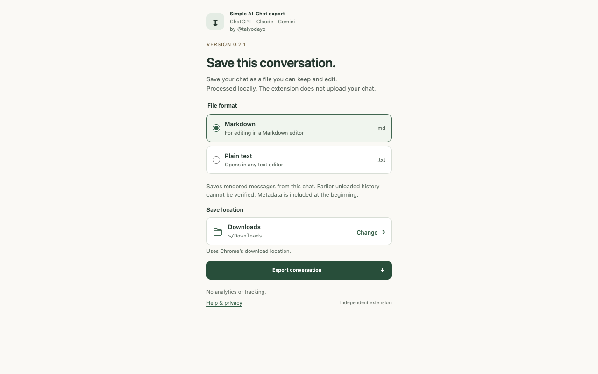

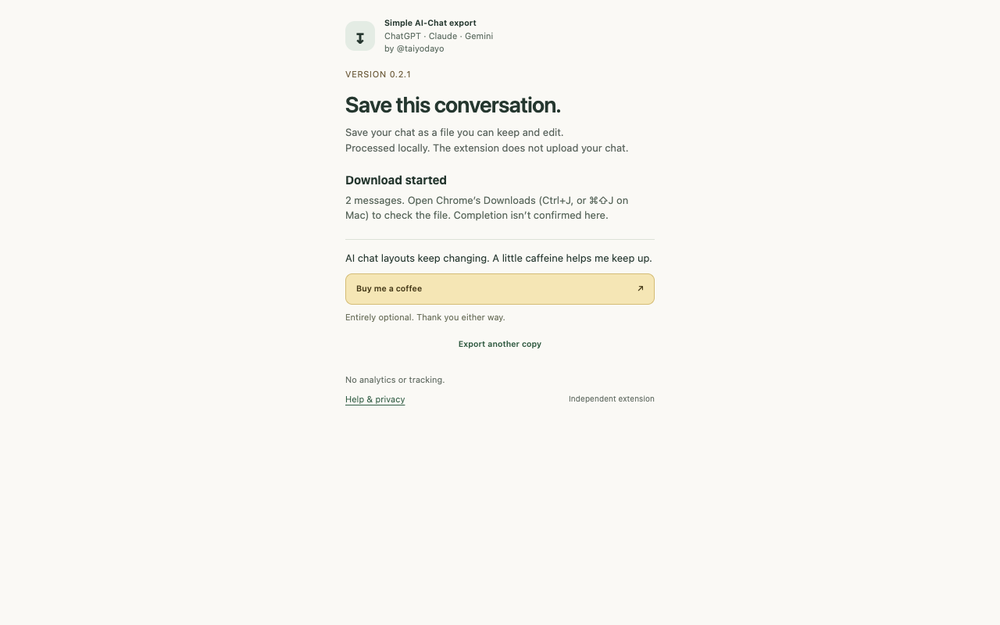

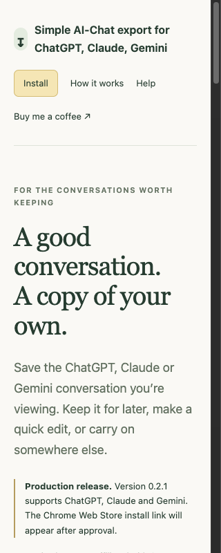

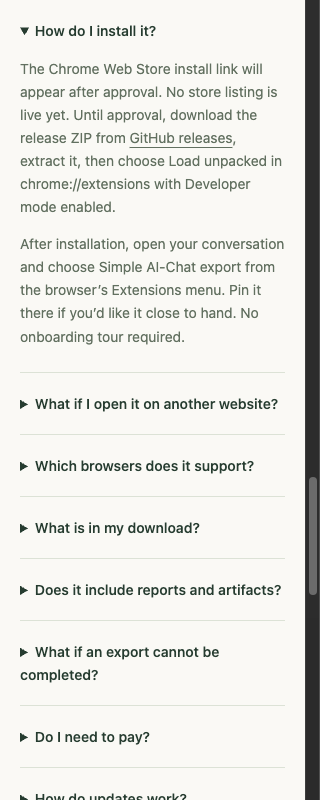

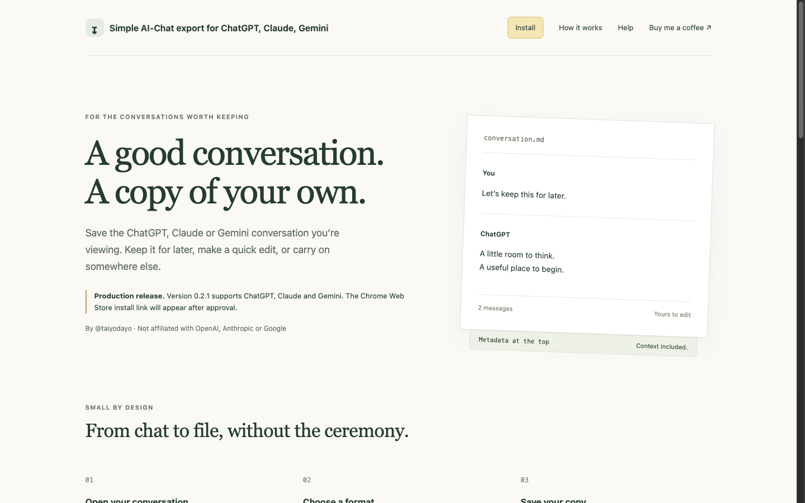

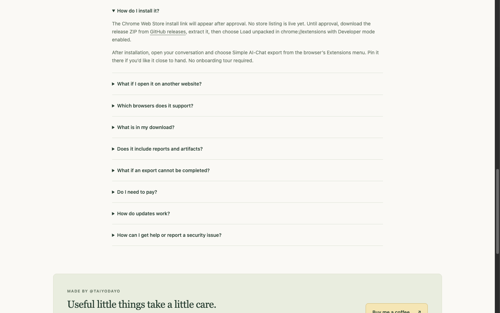


### Preserved baseline audit

### Baseline verdict

The core export screen is calm, understandable and welcoming. A person who already has the extension and wants rendered text from a supported chat has a short path: choose Markdown or plain text, optionally change the folder, and export. Native radio choices, a large export control, visible keyboard focus and specific recovery messages are strong foundations.

**The evidence does not support “all users can finish their desired export in the smoothest path.”** Installation is hard to find on the public page, the product intentionally excludes non-text files/artifacts and cannot verify unloaded history, and this run simulated retrieval/saving rather than checking every current provider layout. The highest-value changes are small copy and hierarchy changes, not a redesign.

**Likely questions are mostly answered**, particularly formats, folders, omissions, privacy, research permission, installation, payment, updates and support. Answers are sometimes far from the moment they are needed. The site/help are somewhat verbose; the export screen itself is only mildly repetitive. **The coffee request is warm and appropriately optional after the task**, but should be secondary to an installation action on the landing page.

### Evidence and capture limits

The first five screenshots use the user's selected Chrome with a fresh local-preview tab; only the target content area was captured. Because the user was actively moving Chrome during store operations, subsequent captures use the same installed Google Chrome binary in an isolated temporary profile and raw Chrome DevTools Protocol. No Playwright CLI/MCP was used. Screenshots were saved and opened before acceptance. Wrong-window/loading captures were rejected and deleted.

Local pages use real extension HTML/CSS/handlers with explicitly injected synthetic fixtures and save outcomes. The development preview says that it does not write files. Its success **is simulated**, not evidence of a real successful download. Research permission was injected; Chrome's actual permission sheet was not shown. Custom-folder selection was simulated; the native OS picker was not assessed.

The source changed during the audit as the parent task removed the downloads permission. Screenshots 01–23 primarily show local v0.2.0/the original preview and public v0.2.0. Screenshots 24–29 show local v0.2.1 with the revised save outcome handling. The public page was not republished by this audit. Treat earlier “Export saved” screenshots as historical within this run; screenshot 24 demonstrates the new Downloads wording. File writes, store state, current live chat/provider compatibility and release packaging were not validated by this UX audit.

Keyboard checks used Chrome input events: Tab entered the format group, ArrowDown selected Plain text, Tab reached Save location, and Enter activated its synthetic folder picker. The saved screenshots show focus. Reflow was checked at 320px and 420px, and the public desktop view at 1440px. Assistive technology announcements, real screen-reader use, zoom preferences, forced colors, native dialogs and full WCAG compliance remain unverified.

### Numbered flow steps

1. **Discover the product — needs improvement.** The public page explains the value with an inviting headline and sample file. At 320px it reflows without horizontal overflow. Its first screen offers coffee and navigation, but no installation/release action. This reverses the useful order for a new visitor: wanting the product should lead directly to installation guidance. Evidence: 14–16. Source support: `site/index.html:34` and `site/index.html:93`.

2. **Find installation guidance — usable once found.** Expanding “How do I install it?” reveals a real GitHub releases link, ZIP/unpack steps and where the extension appears. The answer is far down the mobile page and sits behind disclosure. The pending store state is plainly stated. “No onboarding tour required” adds little. Add a hero action linking directly to this existing guidance/release, and switch to the store installation action after approval. Evidence: 17. Source support: `site/index.html:139`.

3. **Open on the correct conversation — healthy recovery, avoidable first click.** The wrong-page state names the three supported apps and tells people to reopen the extension from Extensions. It keeps controls available and does not show coffee. The current opening screen offers Export before establishing that the target is supported; the capture used a synthetic wrong-page error, so real launch behavior was not assessed. Signed-out recovery likewise tells people where to continue. Evidence: 26–27. Source support: `extension/popup.js:34`.

4. **Choose format — healthy, wording can be more precise.** Two native radio choices explain Markdown and text in plain language; extensions are shown beside them. Keyboard selection works and focus is clearly visible at 320px. “With formatting intact” can overpromise when rich/non-text content is omitted and renderer fidelity is limited. Prefer “With headings, lists and code” or “For formatted text.” The scope note is useful but uses “rendered” and “metadata,” which some users may not understand. Evidence: 01, 03, 21, 23. Source support: `extension/popup.html:28` and `extension/popup.html:43`.

5. **Choose folder — healthy with clear lifetime, discovery caveat.** Save location is directly above Export; Change is recognizable; a selected folder shows a reset option and “used until this window closes.” Keyboard Enter works in the synthetic flow. The default renders a guessed `~/Downloads` while the hint says Chrome's actual configured location is used; people with custom download settings may believe the displayed path is authoritative. Prefer “Chrome's download folder” without an exact guessed path. The full custom path is unavailable to the app; be clear about that. Native picker usability and folder cancellation were not captured. Evidence: 04, 22. Source support: `extension/popup.js:94` and `extension/popup.html:79`.

6. **Export and wait — healthy with smaller-window friction.** During retrieval, choices disable, Cancel appears, and the status explains that the page may scroll. Cancellation returns a usable form, communicates uncertainty about completion and does not ask for coffee. At 420×600, initial Export is below the viewport (top ~605px, bottom ~650px); this is a small-window resilience issue, not a claim that the default window is broken. The launcher requests 440×760. A shorter intro and modest spacing reduction would keep the important action visible more often. Evidence: 09–10, 23. Source support: `extension/launch.js:7` and `extension/popup.css:60`.

7. **Recover from export problems — mostly healthy.** Missing messages, offline retrieval, interrupted saves, unfinished replies and branch changes each have human-readable messages and a next action; coffee remains hidden. Focus moves to the status heading. “We couldn’t confirm the whole conversation” is inconsistent with the adjacent limitation that unloaded history cannot be verified even on success. Prefer “We couldn’t verify the loaded messages,” then give the recovery action. The interrupted-save advice is appropriate for confirmed folder writes; after removing download monitoring, avoid using it to imply that an ordinary Downloads save was observed to fail. Evidence: 06–08, 28–29. Source support: `extension/popup.js:46` and `extension/popup.html:96`.

8. **Allow Deep Research access — understandable, explanation could precede action.** The permission state explains why the embedded report needs access and what Chrome will ask. Refusal does not claim success and allows another deliberate attempt. The CTA changes to “Allow Deep Research and export.” However, the rationale appears below the CTA, after the entire form; in smaller windows the explanation may be offscreen. Place the permission explanation immediately before its action or as a compact notice beside it. The real Chrome prompt, retained grant and report extraction were not tested here. Evidence: 11–13. Source support: `extension/popup.js:10`.

9. **Find the resulting file — good honesty, incomplete handoff.** New v0.2.1 Downloads wording correctly says “Download started” and tells people where to check; confirmed custom-folder outcome says “Export saved.” Both fit at 420×600. Neither result shows the actual filename or destination. Show a short filename plus “Chrome's download folder” or the chosen folder name, and keep the completion distinction. The new download sentence shows both Windows and Mac shortcuts to every user; choosing the current platform's shortcut would save space. All these captures use synthetic outcomes, not real file creation. Evidence: 24–25. Source support: `extension/popup.js:226`.

10. **Optional coffee support — healthy in the extension; landing hierarchy needs adjustment.** The successful result gives a brief human reason for support, a clear coffee link and “Entirely optional. Thank you either way.” Another export remains available. The link's observed destination is `https://buymeacoffee.com/taiyodayo`; it opens in a new tab with no-referrer and noopener settings. Failed states do not display it. This respects the main task. In the new download-started state, the coffee card appears before completion is confirmed: keep the language conditional (“If this saved you some time…”) and don't call that outcome a completed export in help copy. On the public page, make installation the primary action. No payment-provider page or conversion rate was tested. Evidence: 02, 05, 13, 18, 24–25. Source support: `extension/popup.html:100`.

11. **Get help — comprehensive, can be faster to scan.** Extension help answers folder lifetime, Downloads history, research, metadata, omitted attachments/artifacts, privacy and support. Public support gives both GitHub and an email route and asks for a synthetic reproduction. The support email is visibly `chat-simple-export@ongaku.co.uk`. Main help is ~2,100px tall at 440px and mixes immediate how-to steps with substantial privacy/license detail; add a short linked topic index or disclosures for secondary material. Keep practical instructions open. The ordinary help round-trip was not fully exercised in the installed extension; the direct local help page was captured. Evidence: 18, 20. Source support: `extension/help.html:18`, `extension/help.html:75` and `extension/help.html:112`.

12. **Understand privacy — reassuring and readable, substantial detail belongs here.** The separate policy describes conversation handling, saved files, permissions, website hosting and optional support. Reflow at 320px is clean; headings break up the long page. This is a reasonable home for detailed caveats. The landing page repeats much of that policy in “Your device does the work,” “Code you can inspect,” “Privacy, plainly,” and the FAQ; a brief factual summary with a link would reduce friction. Public availability copy and extension/help wording need updating together when the download mechanism/release changes. This audit assessed presentation, not truth/compliance of every claim. Evidence: 14–15, 19–20. Source support: `site/index.html:107` and `site/index.html:267`.

### Prioritized small improvements

| Priority | Improvement                                                                                                                                              | Why it matters                                                                                                                | Screens                             |
| -------- | -------------------------------------------------------------------------------------------------------------------------------------------------------- | ----------------------------------------------------------------------------------------------------------------------------- | ----------------------------------- |
| P1       | Add an obvious install/release-guidance action near the hero; keep coffee secondary.                                                                     | The new visitor's main task currently requires finding a closed FAQ far down the page.                                        | 14–17                               |
| P1       | Keep “Download started” distinct from “Export saved,” and update help/privacy/site language with the v0.2.1 release.                                     | Removing download monitoring makes truthful completion language essential. This is partly implemented in the captured new UI. | 24–25; earlier 19–20 are older copy |
| P2       | Add filename and destination to the result.                                                                                                              | “Where is my file?” remains a likely support question; current result only gives message count.                               | 24–25                               |
| P2       | Use “loaded/displayed messages” consistently and soften “formatting intact.”                                                                             | Prevents overpromising complete history or attachment/format fidelity.                                                        | 01, 05–06, 20–21                    |
| P2       | Put Deep Research permission rationale immediately before its action.                                                                                    | People should understand the permission before acting, including at smaller heights.                                          | 11–12                               |
| P2       | Remove the guessed Downloads path; use Chrome's download-folder description.                                                                             | A custom browser download folder can differ from the visible path.                                                            | 01, 04, 22–23                       |
| P2       | Shorten the repeated intro/privacy sentence and trim spacing enough to fit Export at 420×600.                                                            | Keeps the primary task reachable without unnecessary scrolling.                                                               | 23                                  |
| P3       | Replace “No analytics, because we don't like privacy invasion” with “No tracking or analytics”; move repeated licence/privacy caveats to linked details. | Keeps the tone welcoming and factual while reducing repeated prose.                                                           | 01–02, 14–15, 20                    |

### Accessibility observations

Confirmed in the captured local UI: native grouped radios with visible labels, meaningful button/link text, a heading hierarchy, a clearly visible gold keyboard focus ring, no horizontal overflow at 320px, and large primary controls (~45px high). Status headings receive focus after completion/error; DOM inspection shows a polite atomic live region and form busy state. These are strengths, not proof of assistive-technology compatibility.

Risks/gaps: several secondary labels are 10–11px and can be difficult for low-vision users; reduced viewport height pushes primary/permission actions and descriptions out of view; lengthy help lacks a topic index; symbolic shortcut text may be harder for screen readers than a platform-specific readable instruction. No contrast failure or keyboard trap was demonstrated in this run. Contrast should be measured before claiming compliance; real screen-reader announcements, user zoom/text sizing, forced colors and native prompts still need testing.

### Accepted screenshots

These are the exact saved images opened during this run. Screenshot numbers identify evidence, rather than a single linear visit; the numbered flow above groups related branches. Public full-page images are intentionally long; their companion viewport captures provide readable detail.

#### Original preview and compact states

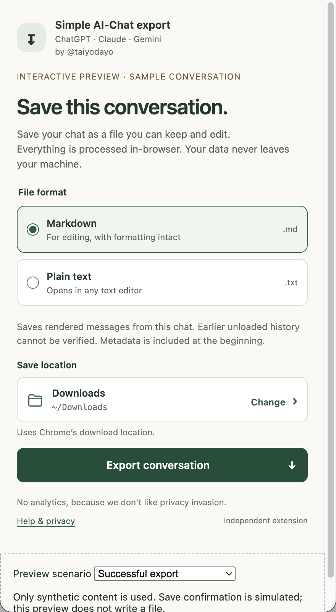

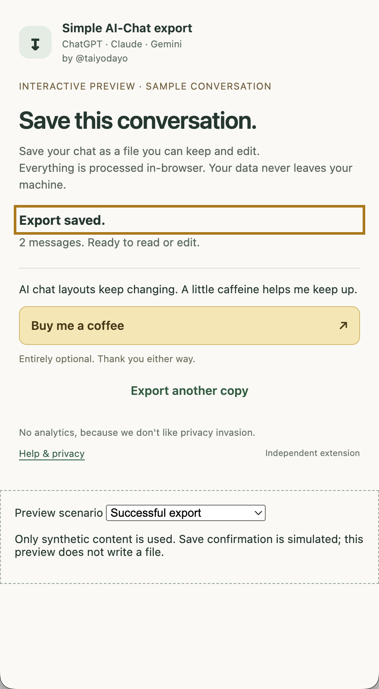

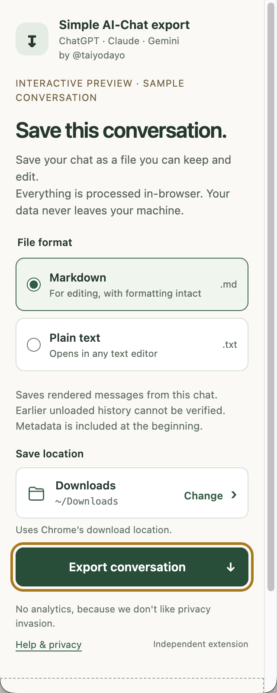

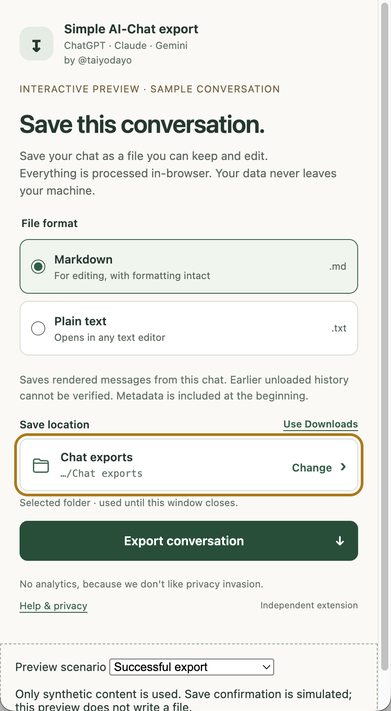

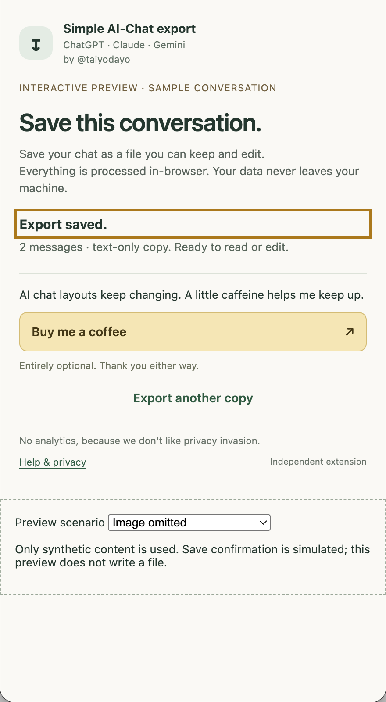

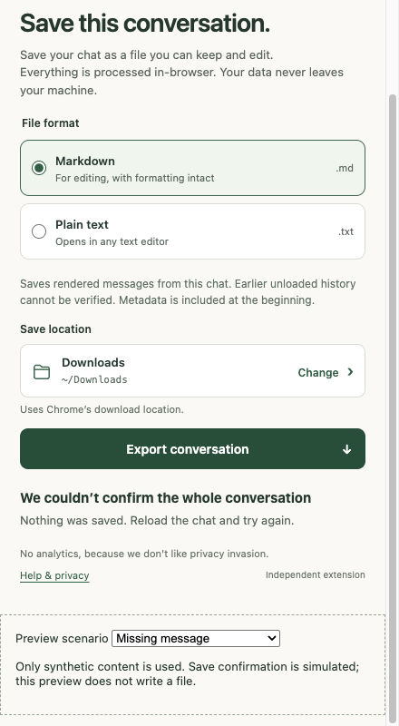

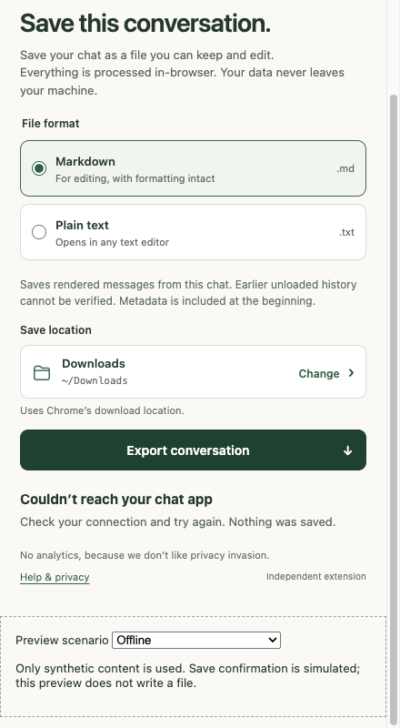

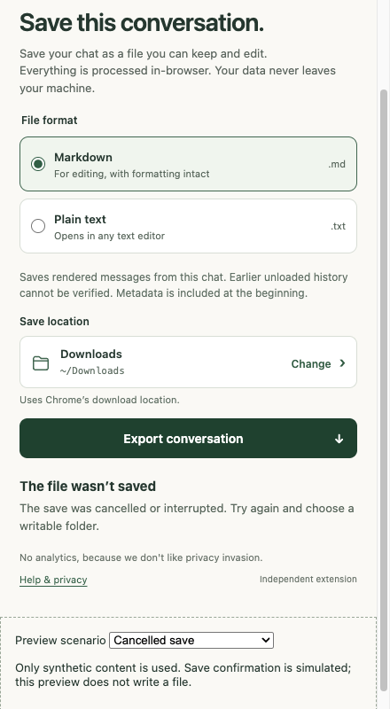

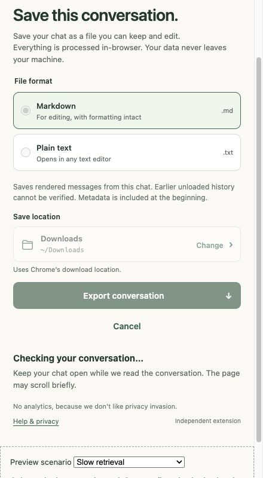

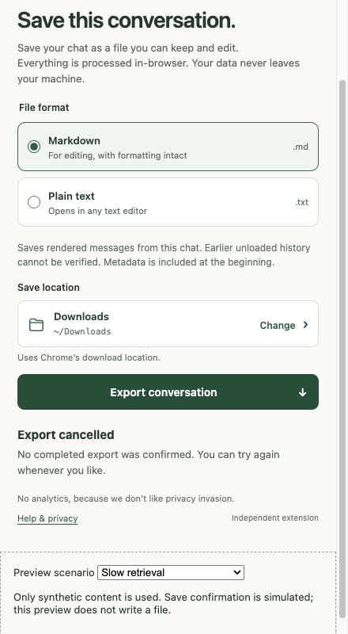

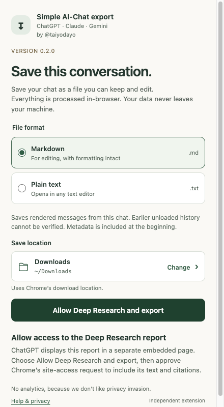

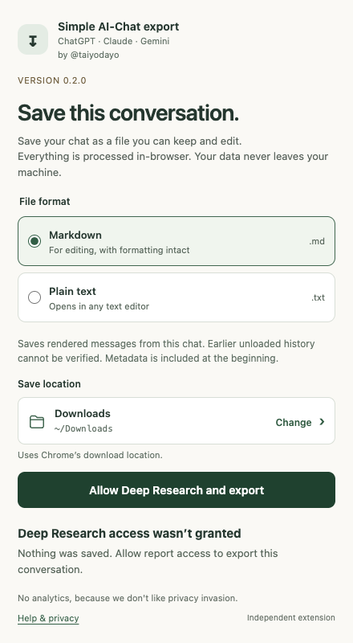


#### Public page and help

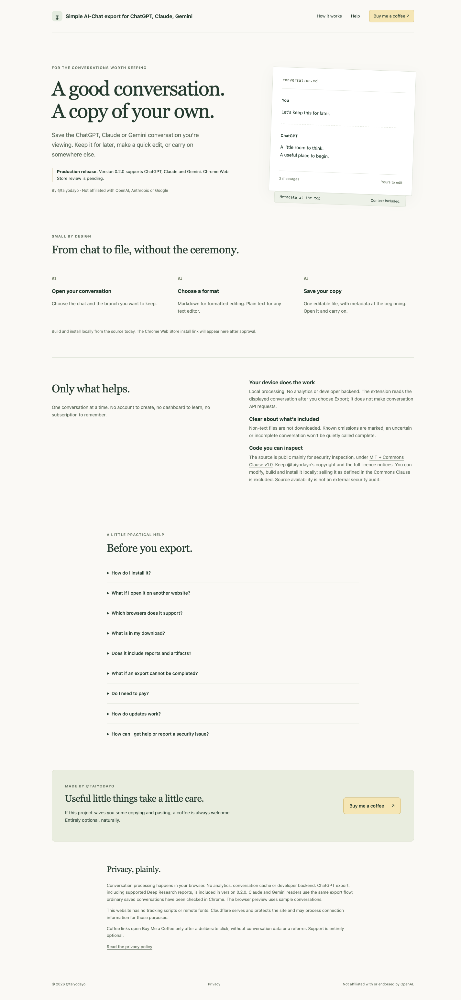

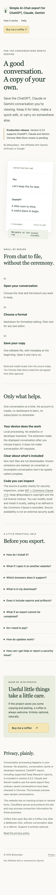

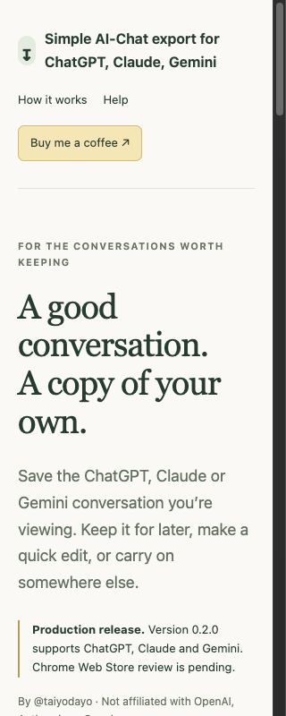

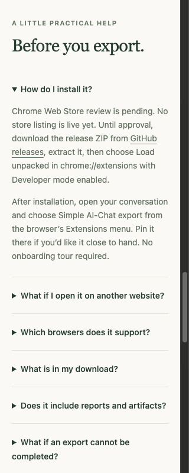

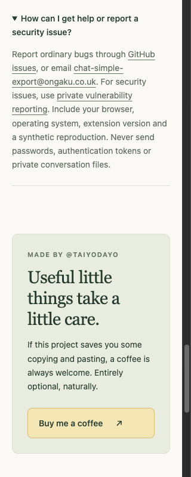

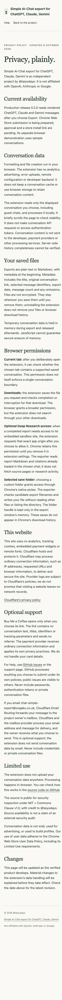

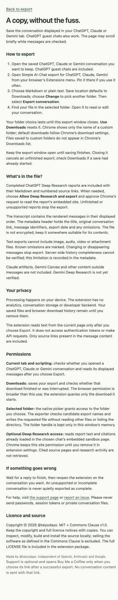

#### Keyboard and updated local outcomes

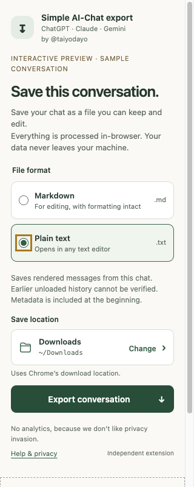

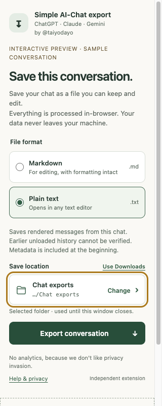

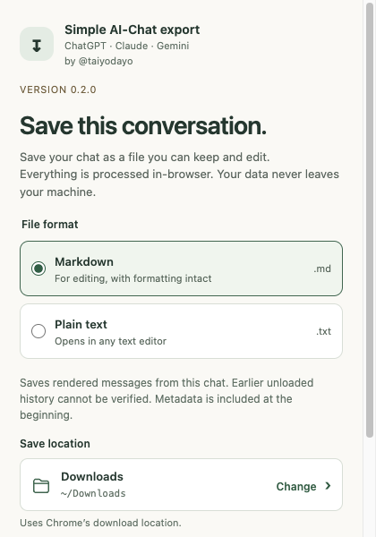

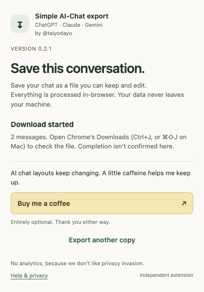

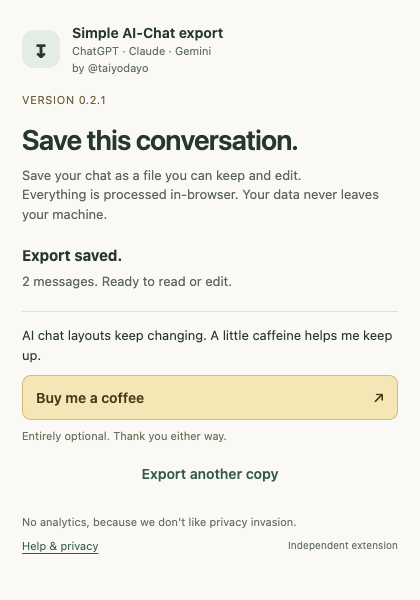

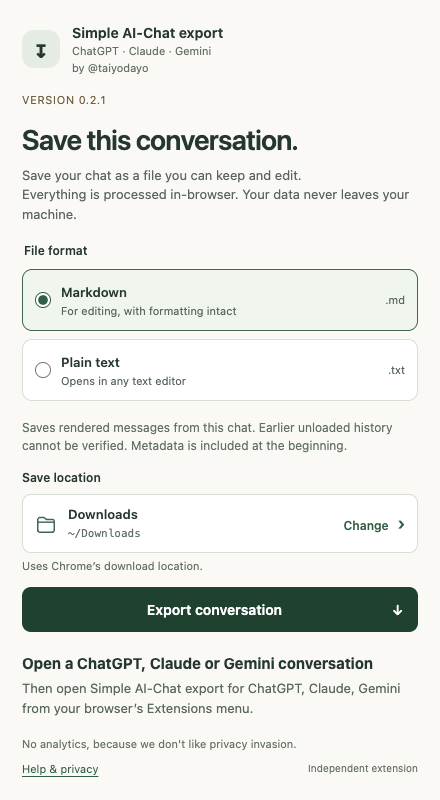

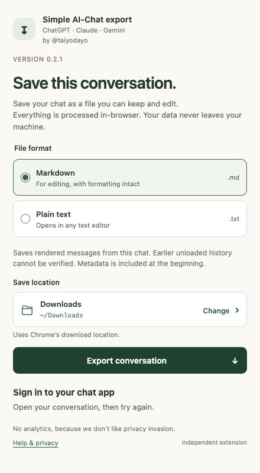


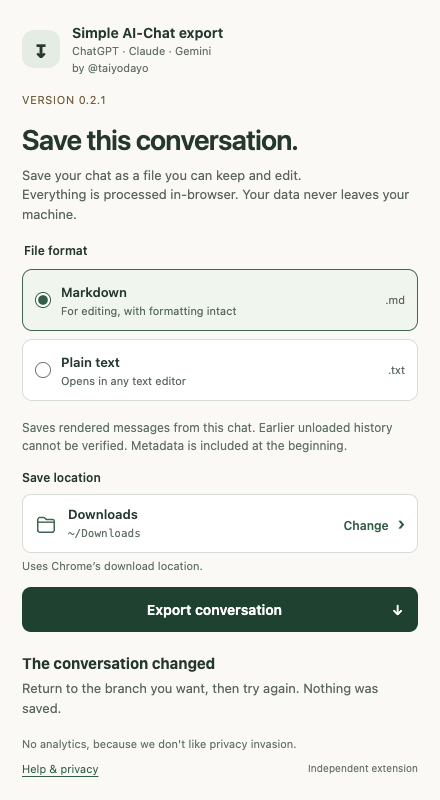
